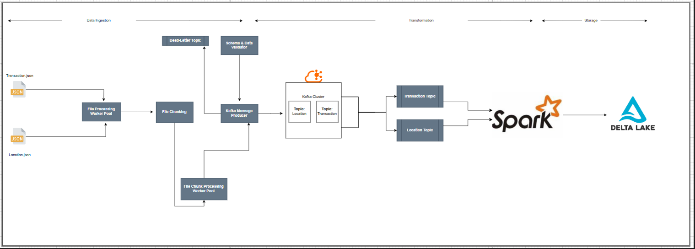

#Kafka Data Ingestion
This project demonstrates a data ingestion pipeline that processes data from two JSON files (Location.json and Transaction.json), validates the schema using jsonschema, and publishes the data to separate Kafka topics in parallel using a thread pool.

##Table of Contents
*[Project Overview] Project Overview
[Features] Features
[Technologies Used] Technologies Used
[Architecture] Architecture
[Setup and Installation] Setup and Installation
[Usage] Usage
[Folder Structure] Folder Structure


##Project Overview
This project ingests streaming data from two Kafka topics:

LocationTopic: Contains location information (e.g., airport codes, country names, and regions).

TransactionTopic: Contains transaction details (e.g., itineraries, passenger counts, and segments).
The data flow includes:

Schema validation: Ensures the JSON files conform to pre-defined schemas.

Parallel ingestion: Publishes the data to separate Kafka topics (LocationTopic and TransactionTopic) using a thread pool.
##Workflow
1. Data Ingestion: Apache Spark consumes data from Kafka topics.
2. Transformations: The data undergoes transformations such as schema validation and flattening.
3. Storage: Processed data is stored in Delta Lake in Parquet format.
4. Querying: The stored data is queried for insights using SQL or BI tools.

##Features
1. Reads data from JSON files.
2. Validates schema using jsonschema.
3. Publishes data to Kafka topics with high throughput using parallel threads.
4. Modular, reusable code for real-world integration.

##Technologies Used

1. Kafka: For message streaming.
2. Python: Core programming language.
3. jsonschema: For schema validation.
4. Threading: For parallel processing.
5. Docker: For containerizing the application (optional).
6. Apache Superset: (Optional) For visualizing processed data.

##Architecture


##Setup and Installation
##Prerequisites
1. Python (>= 3.8)
2. Apache Kafka (set up locally or in Docker)
3. Apache Spark (configured for Kafka integration)
4. Delta Lake support for Spark
5. Pip for Python package management


##Setup and Installation
##Prerequisites
Ensure you have the following installed:

1. Python (>=3.8)
2. Kafka (setup locally or in Docker)
3. Pip
4. Docker (optional for containerized deployment)

##Installation
1. Run these comands:
```
docker build -t data-ingest-image .
docker run --name data-ingest-container data-ingest-image
```
2. Use helm chart:
Created helm chart for kafka under the project flight-transaction-location-data-pipeline which is installed using:
```
minikube start
helm repo add bitnami https://charts.bitnami.com/bitnami
helm repo update
helm install my-kafka bitnami/kafka
kubectl port-forward svc/my-kafka 9092:9092
helm install my-kafka ./kafka
kubectl exec -it my-kafka-kafka-helm-chart-7b5b7844f7-swxww -- /opt/bitnami/kafka/bin/kafka-topics.sh --list --bootstrap-server localhost:9092
kubectl exec -it my-kafka-kafka-helm-chart-7b5b7844f7-swxww -- /opt/bitnami/kafka/bin/kafka-topics.sh --create --topic Transaction --partitions 1 --replication-factor 1 --bootstrap-server localhost:9092
kubectl exec -it my-kafka-kafka-helm-chart-7b5b7844f7-swxww -- /opt/bitnami/kafka/bin/kafka-topics.sh --create --topic Location --partitions 1 --replication-factor 1 --bootstrap-server localhost:9092

```

3. Monitor Kafka topics using:

```
/opt/bitnami/kafka/bin/kafka-console-consumer.sh --bootstrap-server localhost:9092 --topic Location --from-beginning
/opt/bitnami/kafka/bin/kafka-console-consumer.sh --bootstrap-server localhost:9092 --topic Transaction --from-beginning
```


#Folder Structure
```
project/
├── app/
│   ├── logs/
│   │   └── app.log                 # Application logs
│   ├── utils/
│   │   ├── __init__.py             # Thread pool implementation (initialize module)
│   │   ├── file_handler.py         # File handling utilities
│   │   ├── kafka_utils.py          # Kafka producer utilities
│   │   └── schema_validator.py     # Schema validation utilities
│   ├── data/
│   │   ├── locations.json          # Sample location dataset
│   │   └── transactions.json       # Sample transaction dataset
│   ├── schemas/
│   │   ├── location_schema.json    # JSON schema for Location
│   │   └── transaction_schema.json # JSON schema for Transaction
│   ├── config.yaml                 # Configuration for Kafka, schemas, etc.
│   ├── requirements.txt            # Python dependencies
│   ├── main.py                     # Entry point to run the pipeline
│   └── README.md                   # Project documentation
├── tests/                          # Unit tests for your project
│   ├── __init__.py
│   ├── test_file_handler.py        # Unit tests for file handling
│   ├── test_kafka_utils.py         # Unit tests for Kafka producer
│   ├── test_schema_validator.py    # Unit tests for schema validation
│   └── test_main.py                # Unit tests for main pipeline (integration tests)
├── .gitignore                      # Git ignore file to avoid committing unnecessary files
└── docker-compose.yml              # (Optional) For local testing with Docker, if needed
                    # Project documentation
```

##Future Enhancements
1. Add support for data ingestion from other sources (e.g., databases or APIs).
2. Implement real-time monitoring and logging dashboards.
3. Add support for dynamic topic creation.
